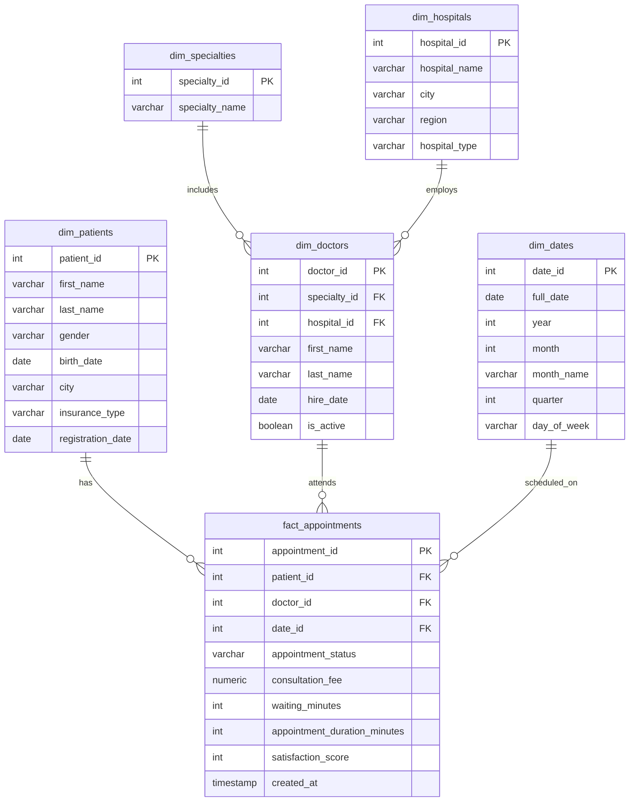

# Hospital Appointments & Patient Care Analysis


## Project Overview

This project simulates a hospital appointment management system using a dimensional data model. The objective is to analyse patient care, appointment performance, hospital revenue and operational efficiency through SQL.


## Database Structure

```text
hospital-appointments-analysis/
│
├── README.md
│
├── sql/
│   ├── 01_schema.sql
│   ├── 02_data.sql
│   └── 03_eda.sql
```

The database follows a star schema design:

**Fact Table:**
 - fact_appointments

**Dimension Tables:**
 - dim_patients
 - dim_doctors
 - dim_specialties
 - dim_hospitals
 - dim_dates

**Main Features:**
 - Relational database design
 - Primary and foreign keys
 - Constraints and data validation
 - Indexes for performance optimisation
 - Views for business reporting
 - Custom SQL function
 - Data quality checks
 - Data cleaning processes
 - Exploratory Data Analysis (EDA)
 - Business insights


## Entity Relationship Diagram




## SQL Concepts Demonstrated
SELECT
INSERT
UPDATE
DELETE
JOINs
GROUP BY
HAVING
CASE
Subqueries
CTEs
Window Functions
CAST
Date Functions
Transactions
User-defined Functions
Business Insights

Some of the analyses performed include:
 - Revenue by hospital
 - Revenue by specialty
 - Revenue by doctor
 - Patient satisfaction by hospital
 - Patient satisfaction by doctor
 - Appointment status distribution
 - Waiting time analysis
 - Insurance revenue contribution
 - Monthly revenue trends
 - Doctor ranking by specialty


## Technologies
- PostgreSQL
- DBeaver
- SQL


## Project Walkthrough

This project includes a video presentation explaining:

- Database design
- Star schema architecture
- Data quality checks
- Data cleaning process
- Exploratory data analysis
- Business insights
- Advanced SQL features used

Video:
[Watch the Loom presentation](https://www.loom.com/share/b323417e32ed4b6d80650408cf23b7b0)
